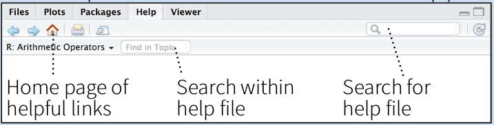

# Introdução ao R  

O uso do R vem crescendo a cada dia e nos últimos anos tem ganho atenção de diferentes pessoas em distintas áreas do conhecimento. É dificil definir os motivos pelo qual isso tem ocorrido, mas alguns pontos principais, são: 
  
* O fato de ser um *software* livre, com a possibilidade de qualquer um criar as análises que ainda não estejam disponíveis;  
* A sintaxe de programação, que frente a outras linguagens de programação, é bem mais simples;  

É comum ao utilizarmos alguma linguagem de programação, usarmos também uma *IDE* (Ambiente integrado de desenvolvimento em tradução livre de *Integrated Development Environment*). É disso que se trata o *RStudio*: um ambiente gráfico, criado para facilitar o desenvolvimento de análises integrando diferentes funcionalidades; Logo o motivo de ser, e uma das razões de seu grande sucesso, é facilitar a vida dos usuários de R. 

Porém, nem sempre os usuários de R e da idea *RStudio* se atentam a alguns detalhes disponíveis, negligenciando todo o potencial de ambas ferramentas. Vamos ver algumas delas.  

**OBS.:** O *RStudio* não é a única *IDE* existente para R; Mas sem dúvidas é um dos mais famosos.  

## O RStudio {#rstudio}  

O *RStudio* é uma *IDE* (Ambiente integrado de desenvolvimento em tradução livre de *Integrated Development Environment*). Ele busca facilitar o processo de desenvolvimento (de uma análise, de uma função, ...) articulando vários elementos importantes a esse processo.  

Vamos ver algumas coisas que nos permitirá exlorar o máximo desse ambiente, e desenvolver boas práticas de desenvolvimento.  

Basicamente a tela inicial do *RStudio* é essa:  

  

O *console* é o responsável por realizar nossas análises. A área *output* é onde podemos ter alguns resultados **gráficos**. Os demais resultados, como *sumários*, serão apresentados no próprio *console*.  

Contudo, no processo de **desenvolvimento**, é comum experimentarmos diversas coisas: desde formas de visualização (gráficos), até tipos de análises. E por isso, sugere-se sempre usar um fluxo de trabalho (o famoso *workflow*) baseado em *script*;  

## Fluxo de trabalho  
A ideia em ter um fluxo de trabalho baseado em *script* é a possibilidade de experimentar tudo o que for necessário em um arquivo de "texto" (não confundir com documento de edição de texto, como o *Word* ou *LibreOffice*) a parte.  

  

Dessa forma, podemos ir escrevendo no script [usando a janela *editor*] todos os "passos" de nossas análises, mantendo apenas os comandos que realmente nos interessa. E sempre que necessário, podemos voltar a utilizá-los.  

Uma forma eficiente de utilizar o *script editor* é usar os atalhos `Cmd/Ctrl + Enter` para executar a linha na qual se encontra o cursor ou todos os comandos que estão selecionados. Assim não se faz necessário vicar alternando entre o *script editor* e o *console*.  

Aliás, entra aqui outros dois temas importantes que iremos explorar melhor depois: reproducibilidade (afinal, se não não se faz ciência); e a possibilidade de colaboração entre pares no desenvolvimento das análises. A partir do momento em que eu documento tudo o que foi feito, eu caminho em direção à reproducibilidade; Assim como posso compartilhar dito script e os dados básicos necessários a um colaborador para que ele aporte algum tipo de ajuda. Perceba, já não estamos falando do seu fluxo de trabalho individual...  

Os autores do livro [R for DataScience](https://r4ds.had.co.nz/) chegam a provocar um reflexão, talvez um pouco filosófica ao perguntar:  

> O que é real em suas análises?

Eles fazem essa provocação pelo fato de muita gente acreditar que o ambiente do R (`environment`) é a parte real da análise, enquanto isso não é aconselhável.  
Em resumo, a ideia é que suas análises residam nos scripts. E que sempre ao executá-lo se possa chegar aos mesmos valores. Justamente por este motivo os autores recomendam que o ambiente de trabalho do R não seja nunca guardado: sempre que precisar voltar a analisar algo que ficou pendente, que tudo seja executado de novo. Veremos mais à frente o uqe fazer quanto estivermos trabalhando com análises que demorem muito e por isso, essa abordagem não seja factível.  

E em se tratando de fluxo de trabalho entre pares, o que é muito comum hoje em dia, começam a surgir algumas boas práticas. Vamos a elas:

Se você já é usuário de R, já deve ter visto em outros *Scripts* os seguintes comandos:  
1. `setwd()` ;  
1. `rm(list=ls())`;  
1. `install.packages()`;  

Apesar de serem importantes e, justamente por este motivo, serem encontrados frequentementes em *scripts* alheios (ou até nos nossos), são comandos considerados execráveis por alguns desenvolvedores do R. Vamos entender o motivo?  
  
### Projetos RStudio  

o primeiro comando da lista anterior é usado para definir qual pasta será usada como diretório de trabalho ("working directory"). E é bem comum que, pelo fato de estamos usando computadores diferentes, estejamos usando diretorios de trabalho diferentes. Então, quando deixamos o comando `setwd()` em nosso script, estamos passando um comando que irá alterar a configuração de trabalho de outra pessoa. E é bem provável que resulte em erro, já que os caminhos aos diretórios são específicos a cada computador.  

> It’s very antisocial to change settings on someone else’s computer!  

Uma funcionalidade bem interessante, que tem a ver com a configuração do diretório de trabalho, mas que poucos sabem ou utilizam é que o RStudio permite trabalharmos com projetos. A criação de um projeto se faz pertinente por facilitar a organização da análise que estamos fazendo.  

Para criar um projeto basta ir em "Arquivos" e clicar em "Novo projeto" (*File>New Project*).  

Na janela que se abre ( \autoref{newproj} ) poderemos escolhe entre criar o projeto em uma nova pasta ou em uma pasta já existente.  
  
{ width=60% }  

**É importante tomar cuidado com os nomes que escolhemos às nossas pastas.** Não é uma boa prática dar nome com espaço ou "caracteres especiais" (ç, ~, `, etc). 

Uma vez criado o seu projeto, você poderá acessá-lo por "Arquivos" e em "Abrir Projetos" (*File>Open Project*). Dessa forma, vc poderá mudar de um projeto a outro e o *RStudio* automaticamente definirá o *Working Directory* correto, sem vc ter que usar o comando `setwd("c:/Exemplo/Projeto")`. Isso além de sempre abrir junto os scripts associados ao projeto em questão.  

Aliás, neste sentido, os autores do livro mencionado anteriormente, sugerem que as suas análises "vivam" aí, no *working directory*. Nele estarão os arquivos a serem carregados, nele serão salvos os gráficos e etc.  

### Paths and directories

Com o fato de trabalharmos com projetos, podemos adotar caminhos relativos (*relative paths*) aos nossos dados. OS caminhos relativos são usados quando indicamos a pasta nas qual vamos salvar um arquivo, considerando que já estamos no diretório de trabalho, então utiliza-se `./sub_pasta/`. Ou seja, a `sub_pasta` se encontra dentro da pasta que estamos usando de diretório de trabalho. Isso facilita no entendimento da estrutura de pastas que estamos usando.  

De qualquer forma, precisamos falar sobre caminho absoluto (*absolute path*). O caminho absoluto é quando indicamos todas as pastas e sub pastas desde nosso diretório raiz (user, no Windows, se não me engano), ou seja: `c:/felipe/projetos/R/Mestrado/analise1`.  
O uso de caminhos absolutos não são aconselháveis pois cada computador (ou seu usuário) adota uma estrutura de pastas, tornando a troca de scripts incompatível.  

Além disso, denpendendo do Sistema Operativo, (Mac/Linux/Windows) a estrutura do caminho absoluto muda bastante. Isso talvez não seja importante, caso só você esteja trabalhando com suas análises. Mas quando um outro colaborador vai te ajudar, essa questão pode até inviabilizar a reproducibilidade do seus códigos.  

**E isso os projetos não resolvem**:
Em *Linux* e *Mac*, se escreve os caminhos com `\`, quanto no Windows usa-se `/`. O *R* funciona com ambos. Mas temos que ter cuidado pois `/` para o *R* tem outro significado. ** Por este motivo, sempre que estiver trabalhando com caminhos e precisar o `/`, use sempre dois**:

**Exemplo**:  

> `c://Exemplo//projeto`  

**Mas como o R funciona com ambos estilos, sugere-se sempre usar `\` na definiao dos caminhos ás pastas:**

> `c:\Exemplo\projeto`  

Por esses motivos o uso de caminhos absolutos não são indicados. Temos, portanto, como boas práticas, o uso de caminhos relativos.  

Caso acredite sem pertinente, desabilite a opção do *RStudio* que salva o ambiente de trabalho sempre ao sair.  

  

## R para ciencia de dados  

  

### Comente seu código!  

O R, assim como outras linguagens de programação possui um caracter reservado para informar ao console o que não deverá ser executado. No caso do R, o caracter é `#`;
Tudo o que estiver à direita do `#` não será interpretado pelo R. Por isso, use e abuse do `#` para escrever seus comentários;  

> com o tempo você vai perceber como escrever comentários de forma "eficiente", ou seja, escrevendo o que realmente importa. Isso é extremamente subjetivo e dependerá também do conhecimento das pessoas com as quais vocês estão colaborando.  

## Help

  
