{ width=70% }  

\newpage
# Versionamento com Git e GitHub  {#intro}  

Controle de versão (ou, versionamento) é uma forma de registrar as alterações realizadas (e a evolução) de pedaços de código/scripts/software ao longo do tempo. É comum usarmos algumas estratégias para essa mesma finalidade, como por exemplo:

* Nomear o script que desenvolvendo com a data da última alteração e o autor responsável:  
>**Tese01_06_FB.R**  
>**Tese02_07_FB.R**  
>**Tese01_08_Orientador_FB.R**  
>**Tese_FINAL_FB.R**  
>**Tese_FINAL_FINALLLLLL_FB.R** 
  
Porém, há sempre a necessidade de versionarmos um mesmo documento de forma sincronizada com outros colaboradores. Geralmente acreditamos que basta compartilhar os dados/documentos em uma pasta em algum sistema de *nuvem* (*oneDrive*, *GoogleDrive*, *Dropbox*, etc), além de combinar com tais colaboradores que deverão seguir a regra anterior de nomeação dos scripts.  

Pode ser que tais estratégias sejam úteis e suficiente para alguns trabalhos. Mas há, hoje em dia, sistemas mais interessantes para fazer o mesmo de forma robusta e até certo ponto, bem mais fácil, com a ajuda do **RStudio**.  

Para o controle de versões de scripts, vamos usar o **Git**; E para podermos trabalhar com outros colaboradores, vamos suar o [**GitHub**](http://github.com) (mas outros sistemas similares podem ser usados, como: [*Gitlab*](http://gitlab.com) ou [*Bitbucket*](https://bitbucket.org/) ). Vamos falar sobre eles mais para frente (*talvez* :).  

## Benefícios  

O controle de versão de seus scripts, códigos, funções e etc são importantes quando:  
  
- Você perceba que seu código não está produzindo o resultado após alguma modificação e você necessite retorná-lo à um determinado ponto anterior;  
- Você, mesmo que sem querer, tiver excluido algum pedaço do seu código e o necessita, mas já não sabe como fazê-lo novamente;  
- Quando você deseja mostrar o que foi feito, ou quer ver o que outro(s) colaborador(es) fez (fizeram);  
- Você quiser testar alguma modificação no código sem comprometer sua integridade;  
- Ou quando você não tiver certeza que o que você pretende fazer vai funcionar;  

Repare que a maioria dos pontos ou situações mencionadas acima se tratam de benefícios que independem de trabalho coletivo. Ou seja, o versionamento não deve ser justificado apenas para trabalhos coletivos, mas para os individuais também. De forma resumida, acredito ser as ferramentas de versionamento uma forma importante de gestão do conhecimento, já que nos permite, independente de estarmos trabalhando sozinhos ou em uma equipe, desenvolver soluções mantendo *tracks* desse processo.   

## *Git*: do que se trata?  
  
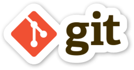{ width=20% }    

*Git* é um sistema de versionamente criado por [Linus Torvald](https://pt.wikipedia.org/wiki/Linus_Torvalds) para permitir e facilitar a colaboração no desenvolvimento do [Linux](https://pt.wikipedia.org/wiki/Linux) de forma [assíncrona](https://pt.wikipedia.org/wiki/Comunica%C3%A7%C3%A3o_ass%C3%ADncrona);  

Em resumo: A ideia é que os colaboradores de um projeto possam criar modificações e fazer testes sem comprometer a versão *estavel* do script/função/software.  
  
### *Git*: Instalação e configuração  
  
1. [Download](https://git-scm.com/downloads)
1. Configuração:
    * Nome de usuário;
    * E-mail;  

```{bash, eval=FALSE}
# No terminal do Git:
git config --global user.name "Mona Lisa"
git config --global user.name

git config --global user.email "email@example.com"
git config --global user.email
```
  
### Configurando RStudio  

O *Git* é um sistema idenpendente do *RStudio*. Ele pode ser usado através de um terminal (`cmd`, no caso do *Windows*), ou até de uma interface gráfica bem básica, chamado *GitGUI*; Contudo, já é comum que as *IDEs* (*Itegrated Development Environment*), como *RStudio*, incorporem as funcionalidades do *Git* em sua interface gráfica para permitir que façamos nosso trabalho e o controle de versão em um mesmo ambiente.  

Para usar o *Git* no *RStudio* teremos que confirgurar-lo (\autoref{Global1}) :  
  
1. Buscar no menu *tools*>*Global Options*;  
1. Clicar em *Git/SVN*;  
1. Clicar em "*Enable version control interface for RStudio projects*";  
  
* `r #emo::ji("warning")` Para usar o Git no RStudio, é necessário sempre trabalhar com os projetos do RStudio;  
* `r #emo::ji("bulb")` Isso te obriga a trabalhar sempre com pastas específicas para cada projeto;  
* `r #emo::ji("award")` Tenha sempre em mente: **se versiona o projeto. Por isso, não misture pastas!!** `r #emo::ji("skull")`  

{ width=50% }  

### Criando um novo projeto com *Git* habilitado  

Ao criar um novo projeto, escolha a primeira opção ( \autoref{ProjGIT1} ) "*New Directory*", e **habilite a opção "*Create a git repository*" ( \autoref{ProjGIT2} )**  

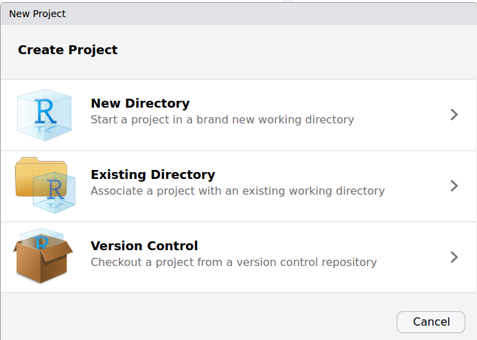{ width=50% }  

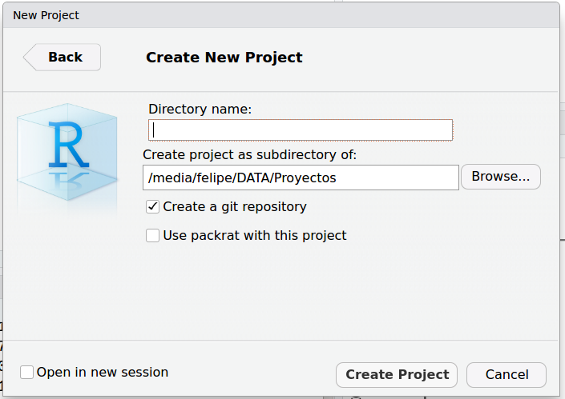{ width=50% }  
  
Agora que temos um projeto de *RStudio* com o *Git* habilitado, vamos criar um script para, a partir dele explorar as funcionalidades do *Git*.
Por isso, no script criado:  
- Vamos carregar o conjunto de dados `mtcars`;  
- Criar um gráfico qualquer;  
- Salvar o script;  

### Versionando (Git commit)  

Agora que já temos um pedaço de código *funcional* do nosso script/projeto, vamos salvar uma primeira versão dele com *Git*:  
  
1. Vamos na opção "*commit*" presente no *menu* *Git* (\autoref{MenuGit});  

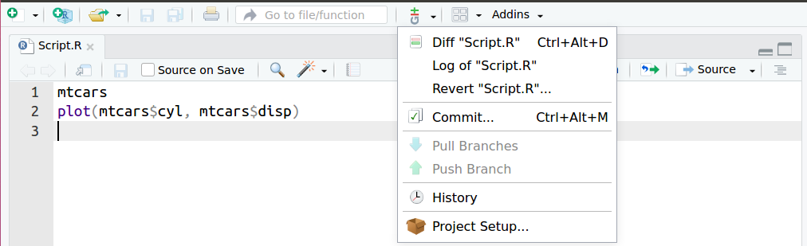{ width=50% }  
  
Na janela que se abre ( \autoref{JanelaCommit} ), poderemos identificar, dentre outros elementos, o script que começamos a desenvolver com um ícone associado:  
  
* `r #emo::ji("question")` Os arquivos marcados com **interrogação** são arquivos que não estão sendo versionados pelo *Git*. 
* `r #emo::ji("a")` Os arquivos marcados com a letra "**A**" (de "*added*") foram adicionadas ao versionamento, também chamado de *stagin area*.  

Inicialmente nenhum arquivo estará sendo versionado. Precisamos informar ao sistema, qual(is) arquivo(s) será(ão) versionados.

> **OBS**: Geralmente não se versiona arquivos como:  
  
* `.Rproj`: Por se tratar do projeto do RStudio, sendo pouco provável que ele seja modificado. Além disso, mais à frente vamos ver como colaborar com outras pessoas, e é bem provavel que o *Rproj* delas sejam diferentes, seja por estarem usando uma versão diferente;  
* Arquivos binários:  

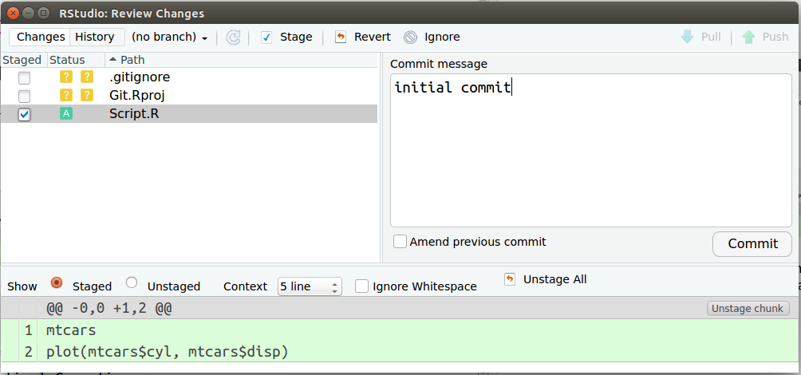{ width=60% }  

Por agora, vamos versionar apenas o script criado anteriormente. Para isso vamos necessitar marcar a caixa na coluna "*Staged*", referente ao arquivo a ser versionado. Perceba que, ao fazê-lo, o arquivo passará a ser marcado com o ícone "**A**", como mencionado anteriormente.  

**O que fizemos até agora foi sinalizar ao Git qual(is) arquivo(s) vamos versionar. Esse ato é chamado de adicionar o arquivo ao "staging area". Contudo, ainda não terminamos, falta fazer o "commit"** para criar a versão em nosso repositório **local**. Veja o fluxo de trabalho simplificado no \autoref{GitFlow1}.  
  
{ width=50% }  
  
Perceba na \autoref{JanelaCommit}, a área em verde. Nela estão os comando adicionados (por isso estão em verde). Quando estivemos criando uma versão em um script onde houve alguma exclusão de código, a linha onde houve tal exclusão estará sinalizada em vermelho.  

O que faremos agora é de fato criar uma versão, como se fosse marcando um momento do desenvolvimento do projeto (nesse caso, do script). A esse "momento" vamos escrever uma mensagem na área "*commit message*". Esse passo é conceitualmente chamado de "*commit*". Tendo feito isso, basta executar o "*commit*" (clicar no botão), como na \autoref{JanelaCommit}.  

* `r #emo::ji("warning")`  A ideia da mensagem de commit é ter um resumo do que foi feito (inclusão de códigos, exclusão, modificações, mas de forma resumida) para facilitar buscas no histórico de modificações/versões/momentos do código. Por padrão, no primeiro commit se usa como mensagem "*initial commit*", já que se trata de um "pota-pé inicial" e o mais importante é o que virá a partir desse primeiro *commit*.  
* Ainda com relação à mensagem, não há uma regra mas vale a pena combinar como será feito, caso você esteja trabalhando com outras pessoas. Em geral se usa até 50 caracteres na primeira linha e as demais de forma livre; Há alguns que gostam de usar emojis `r #emo::ji("smile")`, outros não. De qq forma, se trata de definir uma convenção e segui-la. Caso ache pertinente, há vários artigos sobre como escrever boas menssagens de commit:  [aqui](https://medium.com/compass-true-north/writing-good-commit-messages-fc33af9d6321) ou [aqui](https://www.conventionalcommits.org/en/v1.0.0-beta.2/). Evite o que é apresentado na charge ( \autoref{msgCommit} ):  

{ width=50% }  
  
Para exemplificar as mudanças entre versões, vamos seguir trabalhando neste script. Mas agora, vamos mudar o gráfico. Adicione qualquer outra coisa ou elemento que ache interessante. No meu caso, vou alterar o gráfico para o padrão `ggplot2`. Faça a sua alterção e salve o script. Vamos voltar na janela de *commit* (Passos em \autoref{MenuGit} e depois \autoref{JanelaCommit});  

A linha do *script* que tenha sido modificada deverá estar marcada em vermelho e a modificação acrescentada, em verde, como na \autoref{msgCommit}. Isso estará nó histórico do nosso projeto. **Veja que podemos saber exatamente qual(is) linha(s) foi(ram) modificadas e que modificação(ões) foi(ram) feita(s).** E justamente por termos esse histórico de versões podemos voltar a um ponto anterior de nosso desenvolvimento de forma facilitada, sempre que necessário. É importante notar que sempre estaremos comparando o código atual com a ultima versão salva.  

Bom, sigamos versionando. Temos que colocar nosso arquivo na *staging* área, criar a msg de *commit* e "comitá-la", para gerar uma versão do atual estado de nosso projeto (neste caso, *script*);  

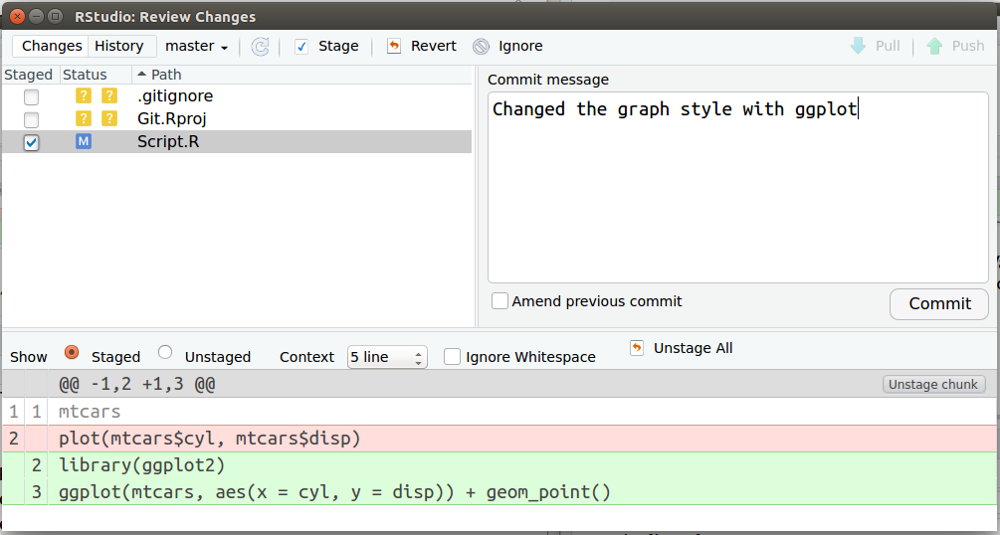{ width=50% }  

* `r #emo::ji("bulb")` Um ponto a ser considerado quando começarem a usar bastante o *Git* é: **quando fazer os commits?**  

Como na maioria das coisas, não há uma definição. Mas sugere-se que sempre se faça quando houver alguma alteração significativa. Seja em correção de *bug*, criação de novas *funções*, etc. Na dúvida, pense em manter o equilíbrio: Não "commitar" a cada alteração qualquer e nem fazer grandes alteração sem commits intermediarios...  

Agora que já temos duas versões do nosso script, vamos explorar algumas funcionalidades interessantes do *Git*.  

#### Git history  

No menu *Git*, temos uma opção chamada *history*. Adivinhem?!?! Ao acessar essa opção podemos ver todo o histórico de versões criadas, as menssagens, o autor (sim, caso alguém faça alguma cagada, saberemos quem foi! :D), a data e o *SHA*. O *SHA* como se fosse um *ID* da versão, uma forma computacional mais interessante de acessar o histórico por permitir identificar se o arquivo foi corrompido.  

Mas veja que bacana: Se clicarmos em uma das versões que temos, podemos ver as alterações feitas... podemos filtrar também para buscar alguma versão em específico ( \autoref{historico} ). Enfim, várias ferramentas que nos vai facilitar a vida como desenvolvedores.  

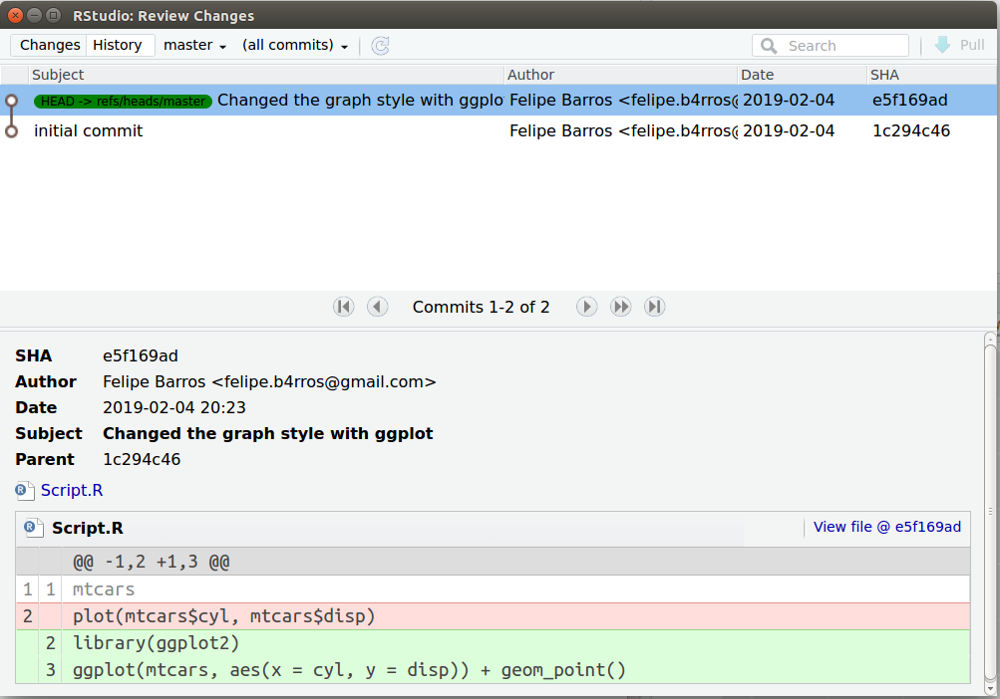{ width=50% }  

#### Git log  

Além do histórico, temos o *log*, que é bem similar ( \autoref{log1} ).  

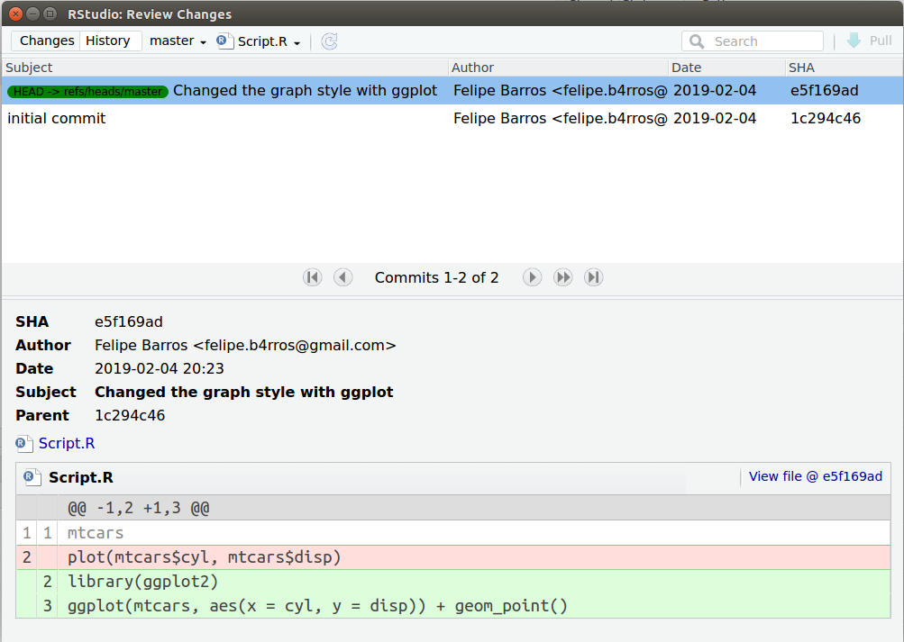{ width=50% }  
  
### Branches  

Até aqui tudo bem, né? Agora vou comentar um conceito bem interessante do *Git*, **mas que não vou explorar por agora**: a possibilidade de criar *branches* de nossos projetos.  

A tradução literal de *branches* é *ramo*... como as das árvores, que derivam de um troco principal... Já conseguiu imaginar para que serve?  

A ideia é comprometermos o mínio possível ao nosso projeto estável (por um projeto estável entendo quando temos scripts/funções/etc funcionando como desejado, por mais que ainda não tenham todas as suas funcionalidades desenvolvidas...).  

Então, vamos dizer que temos um projeto bem simples: um script que carrega um dado e faz um gráfico de dispersão.  

Começando do começo :), ciramos o script, e fazemos a funcionalidade solicitadas: ele carrega um arquivo de dado e gera um gráfico de dispersão. Criamos a primeira versão, que até o momento é a versão estável, já que está executando tudo o que se supõe que ele faça.

Vamos dizer que nos solicitam que o gráfico de dispersão seja colorido segundo alguma categoria presente nos dados. Para não comprometer o script estável que temos no momento, podemos criar um *branch* (ou uma ramo), na qual vamos adicionar o que nos foi solicitado: colorir o gráfico segundo as categorias.  

Uma vez feito isso, vamos testá-lo para ver se ele segue cumprindo com as funcionalidade anteriores e as funcionalidades adicionadas. Uma vez confirmada a qualidade da alteração, podemos juntar a rama criada ao "tronco principal" de nosso projeto (a ese ato, chamamos de *merge*). Dessa forma, podemos ir criando as funcionalidades sem o receio de comprometer o código estável. E, claro, como tudo no processo de versionameto, podemos voltar ao ponto anterior (ou ao tronco principal) sempre que necessário.  

Para facilitar, veja a \autoref{octopus} ou \autoref{branches}:  

{ width=60% }  

{ width=60% }    
  
#### Branches no RStudio
  
É possível criar *branches* pela interface gráfica do *RStudio*. Contudo, o precesso de *merge*, não. Devido a isso, **não detalharei as várias possibilidades dos *branches* **. Apenas apresentarei como criar um e navegar entre os existentes.  

Até o momento, vimos o uso do menu *Git* que se encontra na barra de ferramentas do *RStudio*. Mas há ainda uma outra opção que é a janela *Git* que se encontra, por padrão, alinhada às janelas de `environment`, `history` e `connections` \autoref{MenuGit2}.  

{ width=50% }    

No canto superior direito, há a indicação do *branch* que estamos trabalhando (*master*, neste caso - \autoref{MenuGit2}). Ao lado do nome do *branch* atual, há um ícone simbolizando uma remificação. Ao clicar nele, poderemos criar um *branch* novo ou mudar para um já existente \autoref{CriandoBranch}.  
  
{ width=50% }    
  
Perceba na \autoref{NovaBranch} que após criar o branch, no canto superior direito, onde aparecia o nome *master*, agora aparece o nome do *branch* criado (*boxplot*, neste caso).   

Para fazer alterações e commit, basta seguir o procedimento normal ( \autoref{NovaBranch} ).

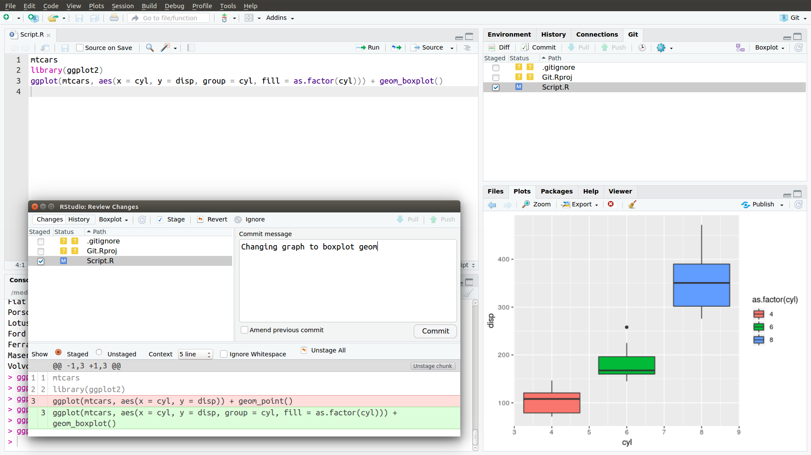{ width=50% }    
  
Para trocar de *branch*, basta usar a mesma ferramenta e, ao invés de criar um novo branch, basta selecionar o *branch* em que deseja trabalhar.   

Caso seja necessário realizar um *merge*, utilize o *shell*;  

## GitHub  

Bem, todo esse tempo estivemos trabalhando e criando versões em nossos computadores (**Git local repository**).  
  
* `r #emo::ji("skull")` Mas algo pode alcontecer, não?! `r #emo::ji("skull")`, nosso computador pode quebrar, ou precisarmos modificar alguma coisa quando estamos viajando sem o nosso PC ou, basta termos interesse que outras pessoas colaborem em nosso projeto.  

{ width=50% }  

Antes que você pense em criar seu projeto versionado em *Git* numa pasta de aplicativo de nuvem (*googleDrive*, por exemplo) comento que há ferramentas melhores e mais apropriada para isso: [GitHub](github.com)  

Vamos, então criar um *login* e posteriormente um **repositorio** no [GitHub](github.com).  

> `r #emo::ji("warning")` Pode ser *GitLab*, *BitBucket*, ou qualquer outro...  

A este repositório serão enviados tudo o que tivermos versionado em nosso *repositório local*, o que permitirá que outros profissionais colaborem em nossos projetos ou até mesmo, em caso de incêndio, seu projeto estará são e salvo.  

### GitHub New repository  

Vamos criar um novo repositório ( \autoref{newRepo} ). Não é necessário criar o repositório já com em arquivo **README**. Caso o faça, Pense que, assim como falaremos na seção \ref{GitHubProjeto}, você estará começando um repositório mais atualizado que o seu *repositório local* e, portanto, após seguir os passos a seguir, você precisará fazer um *Pull Branches* para atualizar eu *repositório local* (o *README* será baixado).  

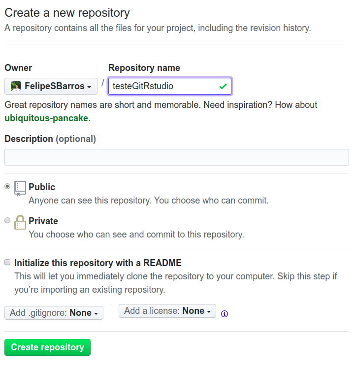{ width=50% }  

### RStudio project/Github  {#GitHubProjeto}

Já que vamos trabalhar com um *repositório remoto*, precisaremos criar um novo projeto que, além do versionamento com *Git*, vai estar *linkado* a tal repositório *remoto* do *GitHub*.  
  
Para isso vamos criar um novo projeto, mas usando a opção *Version Control* ( \autoref{VersionCtrl} ):  
  
{ width=50% }  

A seguir, selecionamos a opção Git ( \autoref{JanelaGitSVN} ).  

> **OBS**: *SVN* é outro sistema de versionamento. Não sei muito a respeito, mas o que ouvi dizer é que se trata de um sistema antigo e muito mais "pesado" que o Git.  

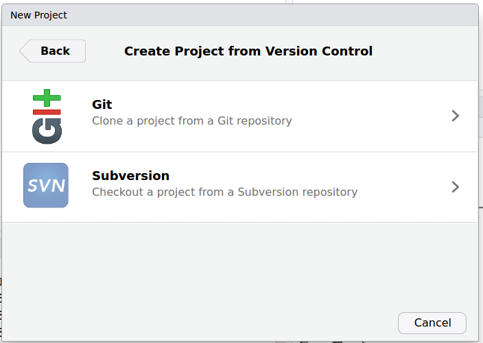{ width=50% }  

Em seguida ( \autoref{JanelaURL} ) temos que adicionar a **url** do repositório criado anteriormente. Automaticamente o nome do diretório será o nome do *repositório remoto*.  

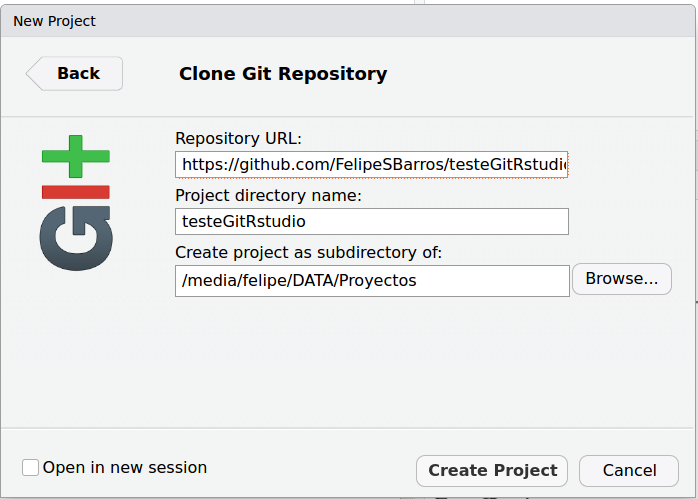{ width=50% }  

Veja ( \autoref{OpcoesGit} ) como muda as opções do menu *Git*.  

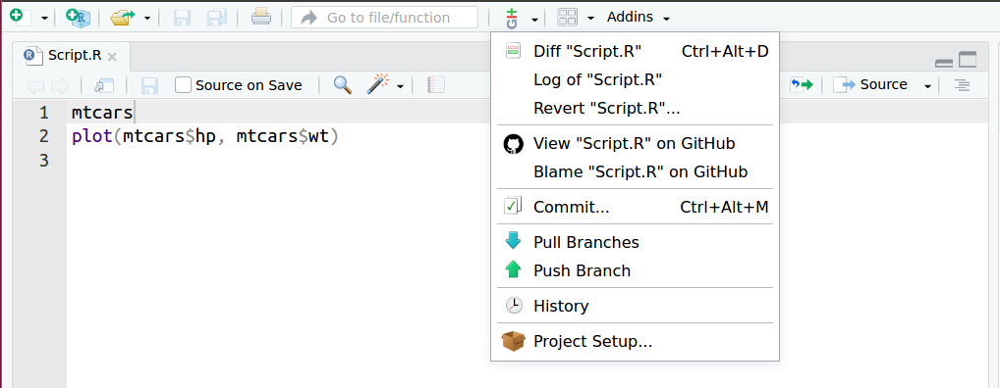{ width=50% }  

Agora temos a possibiidade de fazer o *Pull Branches* ou o *Push Branches* das modificações ao repositório. Claro, isso após todos os passos de adicioná-lo ao *stagin* área e realizar o *commit*.  

Como bem nos indica as setas em cada uma dessas funçoes:  
  
1. *Pull Branches*: serve para atualizarmos nosso repositório **local**, caso o repositório **remoto** esteja mais atualizado;  
1. *Push Branches*: serve para, após criarmos novas versões (atualizarmos nosso reporitório **local**), enviá-las ao repositório **remoto**;  

Além de pensar e discutir a melhor forma de escrever as mensagens de commit, vale refletir sobre **quando seria o momento de enviar as modificações ao repositório externo?**  

Não há uma definição quanto a isso. Podemos trabalhar em nosso repositório local, fazendo quantas modificações e *commits* quisermos que, quando enviarmos ao repositório externo, todos os *commits* serão enviados juntos. Dessa forma sempre teremos o histórico do que foi feito e **não precisamos envia as versão sempre após cria-las**. Passa a ser uma questão de bom-senso ou do que a equipe de desenvolvimento achar melhor.  

Após realizar o *Push* ao repositório remoto do *GitHub*, o mesmo deverá constar, como na \autoref{commitGitHub1} e \autoref{commitGitHub2}, os *commits* realizados.  

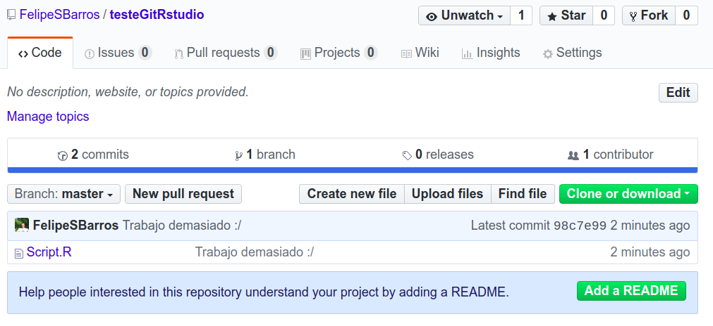{ width=50% }  

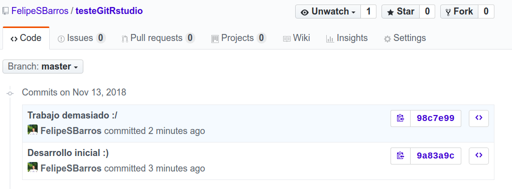{ width=50% }  

Lembram-se do *workflow* do git mostrado anteriormente ( \autoref{GitFlow1} )? Então, com ao considerarmos o uso do *GitHub*, temos um *workflow* assim ( \autoref{GitFlow2} ):

{ width=50% }  

Os sistemas como *GitHub*, *GitLab* e *Bitbucket* foram desenvolvidos para aramzenar e gerir o *repositório local* de versionamento do *Git*, de forma remota. Por isso nos oferece todas as funcionalidades existentes, como *histórico*, *log*, etc. Isso tudo além de garantir que nossos arquivos não ficarão corrompidos, o que pode acontecer com sistemas de nuvem...  

Levem em consideração que o *GitHub* é um sistema criado para versionamento de *software*. Por isso ele possui vários elementos que não foram comentados aqui como, dentre outros:  
  
* A possibilidade de definir *bugs*, *issues*, etc;
* Criar *milestone* par facilitar acompanhamento dos projetos;  

### Projeto com diferentes colaboradores  {#GitHubProjetoColaboradores}

Bom, Já vimos como funciona o *Git*, como guardar nossos projetos em um repositório remoto (*GitHub*)... É prováve que já imaginem como será para que outros profissionais possam colaborar no mesmo projeto, não? A resposta é: pelo *GitHub*. Vamos ver como fazer isso.  

Considerando que vc e seus colaboradores tenham login no *GitHub*, é preciso que alguém dê o ponta-pé inicial, criando o repositório remoto. Aliás, já pode ir criando *commits* e fazendo o *Push*...  

A pessoa que fez isso foi o João \autoref{Personagens}, diretor de onde trabalhamos. A Maria ( \autoref{Personagens} ) será colaboradora do projeto de conservação de vida silvestre. João já começou criando algumas coisas, mas vai precisar da ajuda da Maria para algumas análises estatísticas. Para isso, Maria terá que saber qual é o repositório remoto que John criou e, a partir dele, fazer um *fork* ( \autoref{GitHubFork} )[^1]. Isso é, uma cópia idêntica (incluindo todo o histórico de modificações que João já criou), no *login* do *GitHub* da Maria. Isso é necessário pelo fato do repositório estar no nome do João e, por segurança, Maria não terá autorização para fazer alterações.[^3]  

[^3]: **Não sei se explorarei esse tema, mas é possível criar uma conta de organização e, com isso, informar os colaboradores. Dessa forma todos ficam autorizados a fazer *commits* direto no repositório da organização. Mesmo que isso não seja uma estratégia interessante.**  

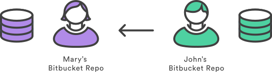{ width=50% }  

[^1]: Ateção: **Fork** e **Clone** são coisas diferentes. *Clone* é o ato de baixar uma cópia identica de um *repositório remoto* em seu *repositório Git local* (ou seja, um download); *Fork* é o ato de copiar um *repositório remoto* de outra pessoa ao seu login.  

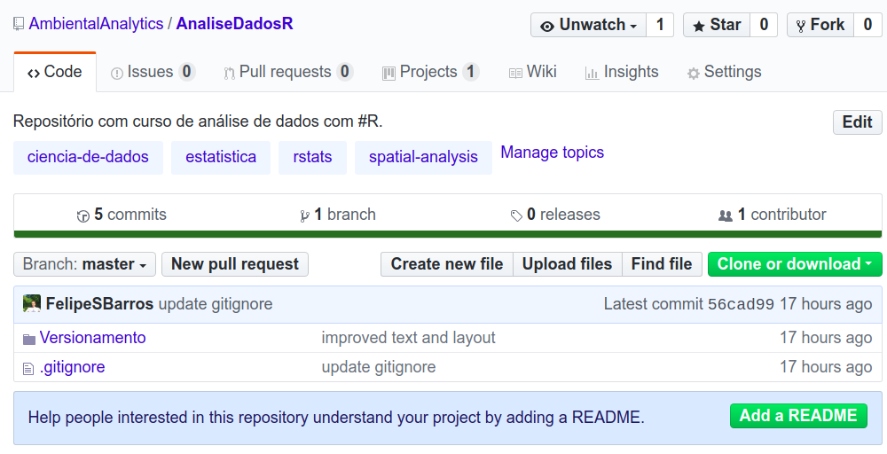{ width=50% }  

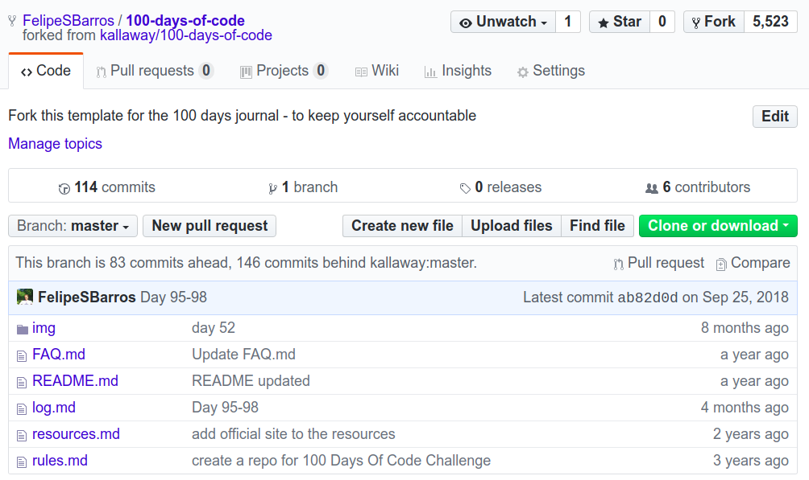{ width=50% }  

Uma vez realizado o *fork*, a Maria deverá fazer o *clone* ( \autoref{GitHubClone} ) para, enfim, poder trabalhar nas modificações necessárias em seu *repositório local* ( \autoref{GitHubDev} ).  

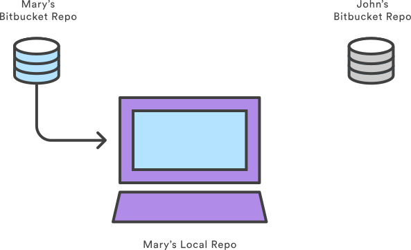{ width=50% }  

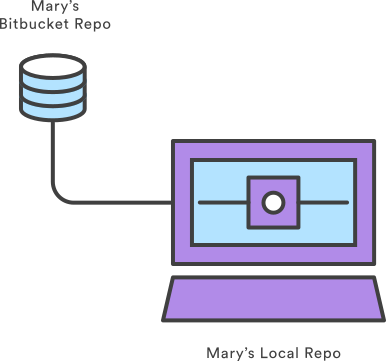{ width=40% }  

Feitas as modificações e os respectivos *commits*, deverá ser feito o *Push* ( \autoref{GitHubPush} ) ao *repositório remoto*.

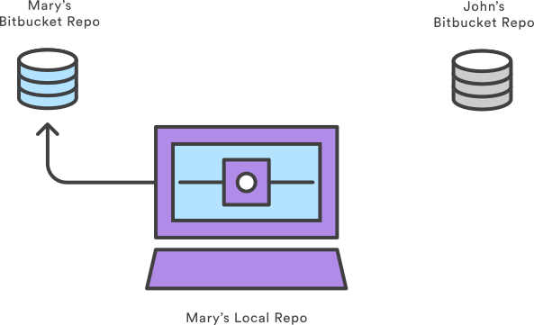{ width=50% }  

Com as alterações sincronizadas ao *repositório remoto* "forkeado" do João, Maria poderá enviar uma solicitação de *Pull request* ( \autoref{GitHubPullRequest} ), avisando ao João, que ela já fez as alterações devidas (análises estatísticas) e que ele já poderá juntar (*merge*) tais alterações ao seu repositório.  

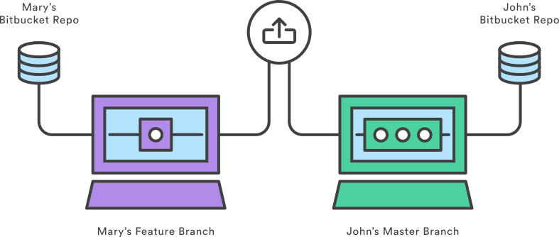{ width=50% }  

João, como mantenedor do repositório poderá ver as alterações e apartir disso, aceitar ou recusar a solicitação. Ao aceitá-la, o seu *repositório remoto* estará mais atualizado que o *repositório local*. Por isso, ele deverá fazer um *Pull* para que seu *repositório local* seja atualizado.  

Ao fazer a solicitação do *Pull Request*, o *GitHub* irá analisar a versão mais atual de ambos repositórios e identificar se há algum conflito [^2] entre eles. Caso não haja, será possível fazer o *merge* sem grandes complicações.  

[^2]: Pode haver conflito caso você tenha feito alguma alteração em um mesmo comando/linha que seu colaborador, e o sistema *Git* não saberá o qeu fazer em tal caso, demandando uma intervenção humana.  

A Maria, para ter a ultima versão (caso João tenha aceito o *merge*) dos códigos, deverá, após o *pull request* ter sido aceito (e o *merge*, realizado), precisará atualizar o seu repositório "forkeado".  

#### Atualizando repositorio remoto  

Para isso, basta que ela abra um novo *pull requqest*. Mas repare que por padão o sentido do *pull request* é sempre do repositório "forkado" ao repositório original. E o que queremos é fazer o oposto apra atualizar o repositório "forkado". Por isso, devemos buscar, na pagina de *pull request* a opção `switching the base`.

> Caso a opção `switching the base` não apareça,  será necessário configurar manualmente o `base fork` como o repositório "forkado" e o `head fork` como o repositório fonte.

Basta seguir o criação do *pull request* e executar o *merge*;  

> Mais informações sobre esse procedimento, veja [aqui](https://stackoverflow.com/a/23853061);  

## Resumo  

* `r #emo::ji("warning")` Versionamento/controle de versão **não é para backup de arquivos!**  
* *Cheat sheets*:
    * [GitHub Training](https://services.github.com/on-demand/downloads/github-git-cheat-sheet.pdf)  
    * [GutHub Education](https://education.github.com/git-cheat-sheet-education.pdf)  
* `r #emo::ji("book")` Livro: [**Git Pro**](https://git-scm.com/book/en/v2)  
*  `r #emo::ji("book")` Outro livro: [**Happy Git and GitHub for the useR**](http://happygitwithr.com/)  
* `r #emo::ji("sos")` [Mais informações](https://support.rstudio.com/hc/en-us/articles/200532077?version=1.1.442&mode=desktop)  
* `r #emo::ji("sos")` [Ajuda na configuração - BootCamp](https://help.github.com/articles/set-up-git/)  
* [Atlassian Bitbucket Tutoriais](https://www.atlassian.com/git/tutorials)  

## Revisão  

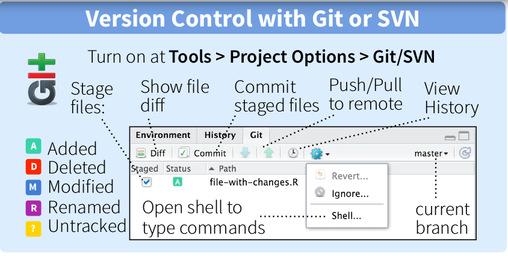